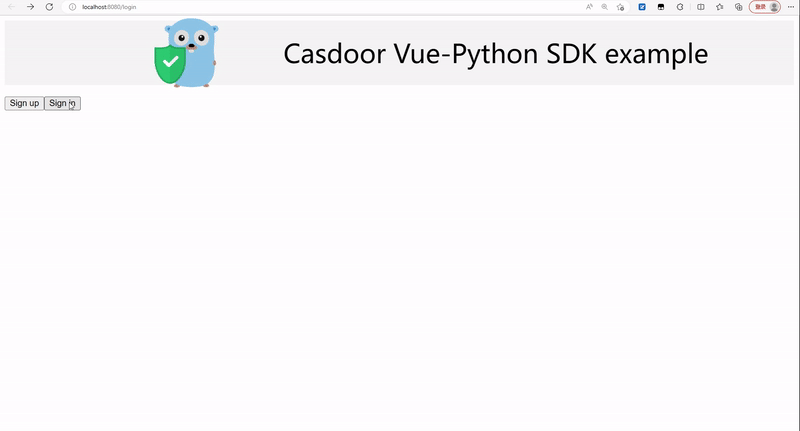
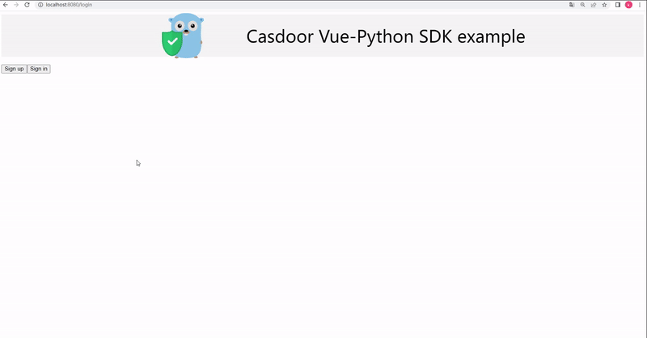

<h1 align="center" style="border-bottom: none;">📦⚡️Casdoor python vue example</h1>
<h3 align="center">An example of casdoor-vue-sdk and casdoor-python-sdk</h3>

## Architecture

Example contains 2 parts:

Name | SDK | Language | Source code
----|------|----|----
Frontend | casdoor-vue-sdk | Javascript + Vue | https://github.com/casdoor/casdoor-python-vue-sdk-example/tree/master/web 
Backend | casdoor-python-sdk | Python + Flask | https://github.com/casdoor/casdoor-python-vue-sdk-example/tree/master/flask 

## Installation
Example uses Casdoor to manage members. So you need to create an organization and an application for the example in a Casdoor instance.
### Necessary configuration

#### Get the code

```shell
git clone https://github.com/casdoor/casdoor
git clone https://github.com/casdoor/casdoor-python-vue-sdk-example
```

#### Run example
- run casdoor
- configure

​		Front end:

```js
// in ./web/src/config.js
export let serverUrl = `http://localhost:5000` //port where flask(backend) runs
```

```js
// in ./web/src/main.js
const config = {
  serverUrl: "http://localhost:8000", //casdoor server url
  clientId: "4262bea2b293539fe45e",
  organizationName: "casbin",
  appName: "app-casnode",
  redirectPath: "/callback",
};
```

​		Back end:

```python
# in ./flask/config.py
# certificate:get in your casdoor endpoint -> application
certificate = '''-----BEGIN CERTIFICATE-----
MIIE+TCCAuGgAwIBAgIDAeJAMA0GCSqGSIb3DQEBCwUAMDYx...
-----END CERTIFICATE-----'''
CASDOOR_SDK = CasdoorSDK(
        endpoint='http://localhost:8000', #casdoor server url
        client_id='4262bea2b293539fe45e',
        client_secret='xxx',
        certificate=certificate,
        org_name='casbin-forum',
        front_endpoint='http://localhost:8000'
    )
```

- install dependencies

  ```shell
  PS .\casdoor-python-vue-sdk-example\web> yarn install
  PS .\casdoor-python-vue-sdk-example\flask> pip install -r requirements.txt
  ```

- run

  ```
  PS .\casdoor-python-vue-sdk-example\web> yarn serve
  PS .\casdoor-python-vue-sdk-example\flask> flask run
  ```

- Now, example runs its front end at port 8080 and runs it's back end at port 5000. You can modify the code and see what will happen.

### Demo videos

1. Normal login:



2. Silent login:


